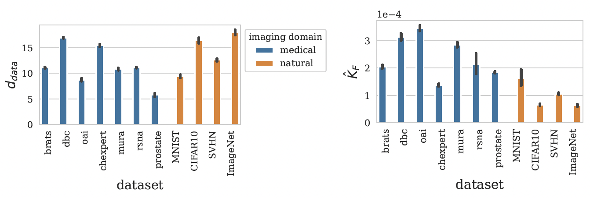
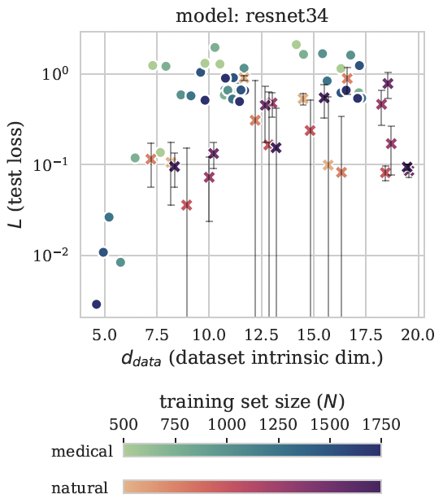

# intrinsic-properties

#### By [Nicholas Konz](https://nickk124.github.io/) and [Maciej Mazurowski](https://sites.duke.edu/mazurowski/).

[]

This is the code for our ICLR 2024 paper "The Effect of Intrinsic Dataset Properties on Generalization: Unraveling Learning Differences Between Natural and Medical Images," where we showed how a model's test performance, adversarial robustness, etc., depends on measurable intrinsic properties of its training set. Using this code, you can measure these intrinsic properties of your dataset: 
1. Label sharpness $\hat{K}_F$, our proposed metric which measures the extent to which images in the dataset can resemble each other while still having
different labels.
2. Intrinsic dimension / complexity $d_{\text{data}}$.

[]

## Quickstart
### Code Usage/Installation

1. Run `pip3 install -r requirements.txt` to install the necessary packages.
2. Clone `https://github.com/ppope/dimensions` into your main directory.

### Measure intrinsic properties of your dataset (on GPU)

```python
from datasetproperties import compute_labelsharpness, compute_intrinsicdim

dataset = torchvision.datasets.CIFAR10(root='data')
# or any torch.utils.data.Dataset

KF = compute_labelsharpness(dataset)
datadim = compute_intrinsicdim(dataset)
```

## Reproducing Paper Results

### Dataset Setup
**Natural image datasets:** the natural image datasets used in our paper and code (ImageNet, CIFAR-10, SVHN and MNIST) are just the [torchvision Datasets](https://pytorch.org/vision/0.16/datasets.html).

**Medical image datasets:** The medical image datasets are a bit more complicated to install, but step-by-step instructions can be found in step (1) of [the tutorial for our previous paper](https://github.com/mazurowski-lab/radiologyintrinsicmanifolds/blob/main/reproducibility_tutorial.md).

We provide all code used to reproduce the experiments in our paper:
1. `train.py`: run to train multiple models on the different datasets.
2. `estimate_datadim_allmodels.py`: run to estimate the intrinsic dimension of the training sets of multiple models.
3. `estimate_reprdim_allmodels.py`: run to estimate the intrinsic dimension of the learned representations of multiple models, for model layers of choice.
4. `adv_atk_allmodels.py`: run to evaluate the robustness of multiple models to adversarial attack.

## Citation

Please cite our ICLR 2024 paper if you use our code or reference our work (published version citation forthcoming):
```bib
@inproceedings{konz2024intrinsicproperties,
title={The Effect of Intrinsic Dataset Properties on Generalization: Unraveling Learning Differences Between Natural and Medical Images},
author={Konz, Nicholas and Mazurowski, Maciej A},
booktitle={The Twelfth International Conference on Learning Representations (ICLR)},
year={2024},
url={https://openreview.net/forum?id=ixP76Y33y1}
}

We also provide all code used to reproduce the experiments in our paper:
1. `train.py`: Train multiple models on the different datasets.
2. `estimate_dataID_allmodels.py`: Estimate the intrinsic dimension of the training sets of multiple models.
3. `estimate_reprID_allmodels.py`: Estimate the intrinsic dimension of the learned representations of multiple models, for model layers of choice.
4. `adv_atk_allmodels.py`: Evaluate the robustness of multiple models to adversarial attack.